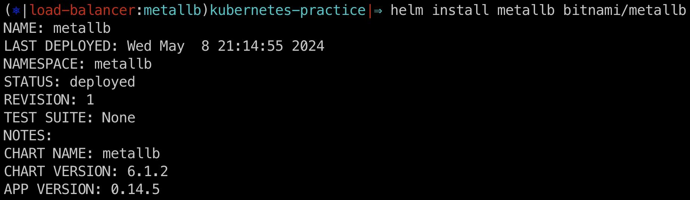
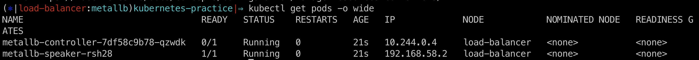
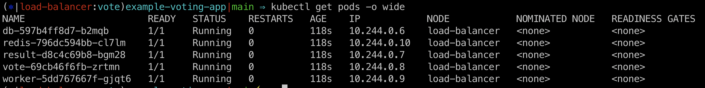
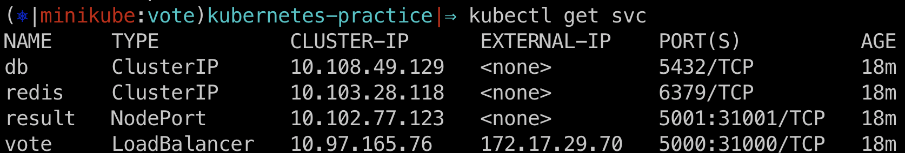
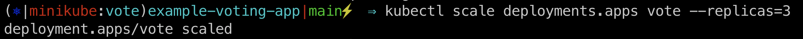

### 헬름을 이용해 MetalLB를 설치합니다.




### 로드밸런서에 할당할 외부에서 접속 가능한 IP 대역을 지정합니다.

```yaml
apiVersion: v1
kind: ConfigMap
metadata:
  namespace: metallb
  name: config
data:
  config: |
    address-pools:
    - name: fist-pool
      protocol: layer2
      addresses:
      - 192.168.9.1-192.168.9.9
```

```yaml
apiVersion: metallb.io/v1beta1
kind: L2Advertisement
metadata:
  name: l2
  namespace: metallb
spec:
  ipAddressPools:
    - first-pool
```

**configMap, L2Advertisement 적용**

```shell
$kubectl apply -f
```

### 테스트 용도의 데모 ‘voting-app’ 애플리케이션을 설치합니다.



### 프론트엔드 웹에서 사용하는 서비스 타입을 LoadBalancer로 지정합니다.

```yaml
apiVersion: v1
kind: Service
metadata:
  labels:
    app: vote
  name: vote
spec:
  type: LoadBalancer
  ports:
    - name: "vote-service"
      port: 80
      targetPort: 80
  selector:
    app: vote
```



### 각 파드에 정상적으로 부하분산이 되는지 확인합니다


